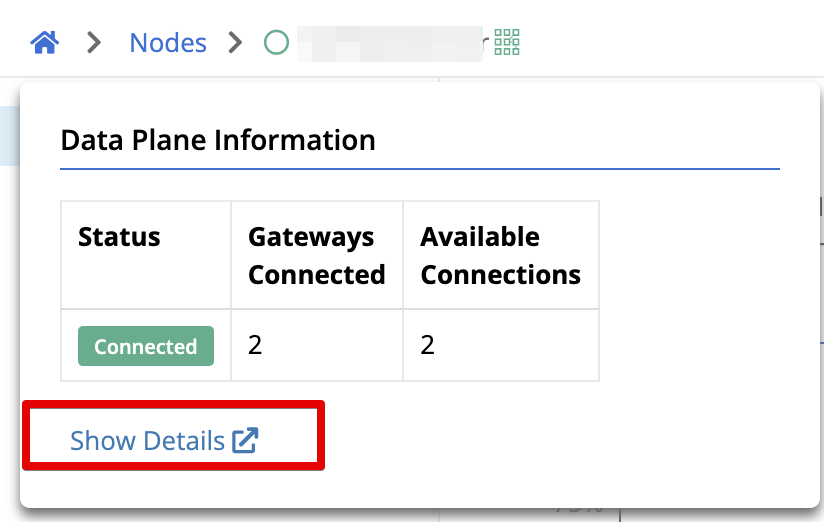
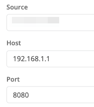
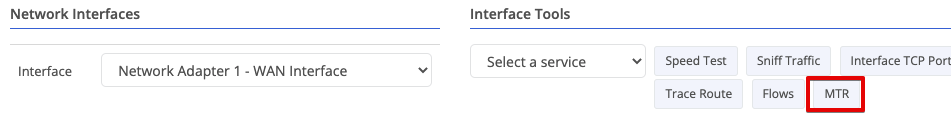
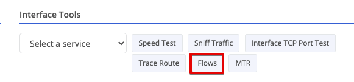
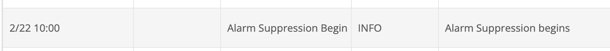
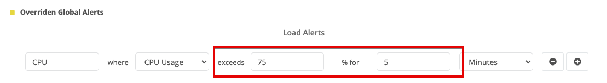
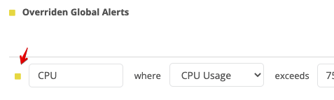

## Data Plane Status Panel

The previous release added a pop-up table that displayed statistics about a node’s connections to other node such as gateways.  We’ve now moved most of this information to a new panel dedicated for this purpose.  

Hovering over the Data Plane status indicator next to the node name still includes basic details about the number of gateways known and connected. And it includes a link to the new panel for more detail:

Clicking that link or just selecting the Data Plane panel from the left navigation bar will bring you to a new page showing much of the same detail as the [previous pop-up table]().

### Data Plane Historical Stats

You can now load historical latency data about a connection between this node and a connected gateway. Simply select the gateway from the table by clicking it, choose a start and end time and click `Load`.

## Portal Tool Improvements

### Tool Setting History

A common pain point when using the tools within the Trustgrid Portal was that if you had to rerun a tool you had to reenter the values into the prompt.   With this release Trustgrid is introducing an execution history that will make rerunning a tool much simpler for users.

As an example, if I run the Interface [TCP Port Test]() tool for the first time, the target IP and port will be the defaults 192.168.1.1 and port 80

If I change these to a new IP and port and run (e.g. 172.16.22.199 and port 22)  and run the tool. The next time I run the tool these settings will be populated automatically.

Additionally, I can click the History tab on the right to see the last few execution settings. I simply need to click apply to rerun one of the configurations listed.

### MTR Tool

MTR (or my trace route) is an alternative to the traditional traceroute tool that expands on the data gathered and reported in a number of ways. It can be run interactively to run continuously until stopped, gather additional statistics, report multiple paths more clearly and more.  While this tool has been available from within the Terminal for some time, Trustgrid has now made this accessible directly from the portal user interface.

> To use this new feature, the node must be running the latest Trustgrid package version (`1.5.20220215-1159`) or newer

To run the tool, navigate to the Network → Interfaces section of a node and select the desired interface. Then click the MTR button.

The default settings are to target the local loopback interface IP (`127.0.0.1`) and run 10 times (`-c 10`). 

Change the target to the desired IP or host name and update the options.  Some useful options include:

* `-T` to use TCP instead of ICMP and can be combined with `-P XXXX` to target a specific known listening port. This can be useful when targeting a Trustgrid gateway from and edge node. (e.g. `-T -P 8443`)

* `-w` runs MTR in wide screen reporting mode. You will not see output on the screen until the `-c` count has completed but the output will persist, unlike when run interactively where it is cleared from the screen at completion.

See the [mtr man page](https://manpages.ubuntu.com/manpages/bionic/man8/mtr.8.html) for additional options.  

### Interface Flows Tool

Under the Network → Interface section you will see a new “Flows” tool listed

> To use this new feature, the node must be running the latest Trustgrid package version (`1.5.20220215-1159`) or newer

This tool provides information about flows traversing an interface, similar to who the VPN “View Virtual Translations Table” tool shows flows traversing the VPN. 

Launching the tool you have a number of options to filter the results. Or you can run without filters to return all flows.

The resulting table lists the flow found on the interface. This can be sorted by column.

Additionally, any active flow can be Terminated (disconnected) from within the tool. You will be prompted to confirm.

## Network Interface Improvements

### Interface Speed and Duplex

The Trustgrid portal now displays the negotiated speed and duplex values:

And it now allows you to change from the default Auto negotiation setting to a manual setting. This is frequently necessary when the connected port is hard set to a speed and duplex value, which breaks auto negotiation. 

## Alert Improvements

### Alert Suppression Window Events

An Alert Suppression Window prevents the Trustgrid system from sending notification to alarm channels for a scheduled period of time. This is useful for preventing noisy alerts during planned maintenance. Historically, correlating events to this time period required remembering when the maintenance occurred. 

After the suppression window is closed, either by cancelling or allowing it to expire, two events are created.  One for the scheduled start:

And another for the actual end time:

These events are viewable at both the node and organization level to make it easy to correlate events to the maintenance window.

### Override Domain Level Threshold Alerts

Threshold alerts, such as CPU % or latency, can be configured to apply to all nodes within a domain.  But sometimes it is necessary for a specific node to have different thresholds defined. With this release, the domain thresholds can be overridden. 

If you navigate to the Alerts panel of a node, you will see a section at the bottom titled Global Alerts. It will list all threshold alerts defined at the higher, domain level.  Click the Override button to set a node specific value.

Define a new threshold value or duration

After you click `Save`, the value will have a yellow square to indicate it is an override.

### Threshold Alerts Included Data Points

Previously it wasn’t always clear why a threshold alert, such as an alarm regarding latency, exceeded the configured threshold.  Even if you connected immediate to the device and checked the latency might have returned to normal. 

Now the JSON payload sent to alarm [channels]() (email, Slack, PagerDuty, etc.) can include the data points used to calculate the average that exceeded the threshold. This is in a new section called `details` and the values are in pairs of the timestamp `t` (unix time) and value `v` (in milliseconds in the example below). 


...
"details":	{
	"values":	[
		{"t":1645664460,"v":1310},
		{"t":1645664520,"v":1310},
		{"t":1645664580,"v":31},
		{"t":1645664640,"v":31},
		{"t":1645664700,"v":890}
	],
}
...


