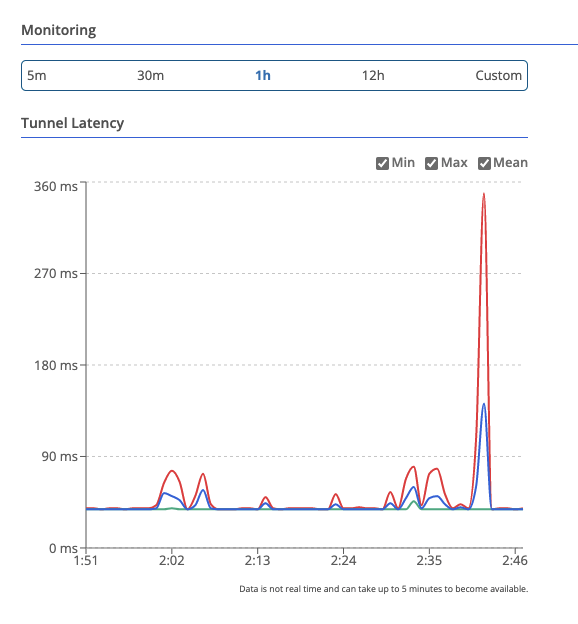
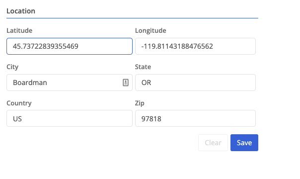
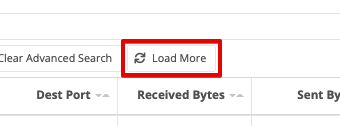

## Faster Node Overview Graphs

With this release we have reduced the time it takes for the initial Overview graphs to load when you first navigate to the node.  

## New Time Range Selector

Previously the Trustgrid portal used a few different time range selectors on different pages, none of which were the most user friendly.   Trustgrid is standardizing on a new selector shown below which some key new abilities:

* Change from Local (browser) time zone to UTC
* Switch from an Absolute (e.g June 1 at 10am to Jun 1 at 11am) to a Relative time (last X hours)

The new selector is in use at:

* Flow Logs - Advanced Search
* Data Plane - Gateway monitoring statistics

## Data Plane Panel Improvements

### Data Plane Monitor Graph

Previously the statistics for latency (visible after clicking on the name of a connected gateway) were shown in three separate graphs: min, max, and mean. This sometimes made it hard to compare as they had different scales.  Now these data points are visible on a single graph. They can also be deselected with the graph scale adjusting automatically. 

### Sort Peers by Connected Status

Previously the connected status column didn’t allow you to sort. If you had a lot of connected peers and wanted to focus on disconnected ones it was a challenge.  Now you can sort by clicking on the column header.

## Node Location Tab

There is a new Location panel under History on the node detail page.  This page allows you to:

* Specify the Latitude and Longitude of used to display the location of the node on the network map.  You can utilize a map such as Google Maps to determine these coordinates
* Specify the City, State, Country and Zip where the node is deployed.  Currently this is for informational purposes only and does not update the Lat/Long coordinates. 

## Flow Log Improvements

In addition to the new time range selector, we have also improved how advanced searches return results.  Previously, if your search included a long time range or was run on a node with a lot of flows the system could return partial results.  Now we’ve added a “Load More” button and additional results will be returned. 

## Access Policy Improvements

We’ve added several improvements to the Access Policy table for a virtual network.

* You can now select and bulk delete rules
* New special destination object options:
	* `private` - all IP v4 blocks defined as private by [RFC 1918](https://en.wikipedia.org/wiki/Private_network#Private_IPv4_addresses)
	* `public` - public will cover all other IP v4 addresses

