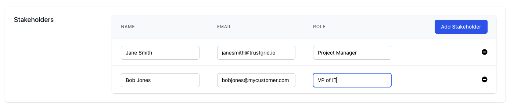
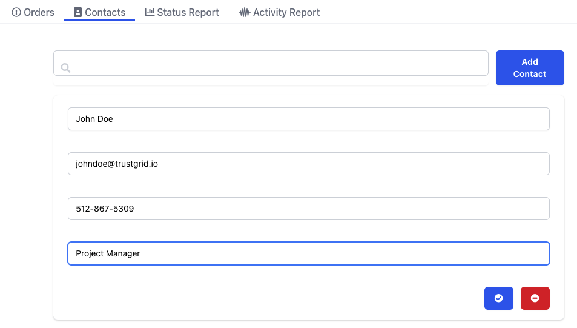
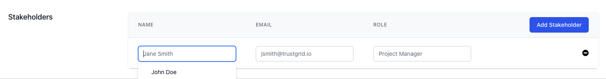
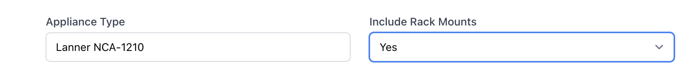

## Trustgrid Permissions Restructuring

Trustgrid’s portal and API have used Role based permissions to manage access within the Trustgrid system. As Trustgrid has expanded our feature set, adding features like containers, and our user base have grown the predefined role structure has become a poor fit. Many times these new features required Trustgrid Support to grant access to users.  Additionally, what each role could and could not do was opaque to customers. 

With this release will be migrating to a [policy-based]() approach that will allow customers to independently tailor permissions to meet their own use cases. Customers will also be able to see exactly what rights policies allow and what policy is granting a user access [directly in the portal](). 

This migration will also allow future enhancements such as automatic policy assignment based on group membership, resource based policies limiting users to specific nodes/clusters, and more.  

### How it Works

The new policy permission works as such:

* Users can be attached to one or more policy
* Policies are defined that either allow or explicitly deny permissions or actions
	* Permission are grouped according to the related feature/objects set
		* Read allows a user to view that group of related objects
		* Modify will allow users to add, change or delete those objects
		* Additional actions such as running tools on a node can be allowed/denied 
	* A denied permission will override any allowed permission in another policy

### Migration of Role Permissions to Policies

Trustgrid previously had 4 predefined roles. With this release these will be migrated into 5 new builtin policies, and an additional policy will be created. As part of this migration Trustgrid is also making sure these policies only include the “least-privileges” required to perform the intent of each of the previously defined roles. 

During the release process users previously assigned a role will be automatically assigned the corresponding policy or policies listed below

Below is a list of our historic roles and the policies that replace them plus any known changes. If users previously assigned a role lose a tool or function they need, they can either be attached to a higher level builtin policy with the appropriate permissions or a custom policy can be created and attached.

#### Monitor (now [tg-builtin-monitor]() policy)

Changes:
* Monitor no longer has access to troubleshooting tools. These were removed because some of these seemed to exceed the privileges required for the user types expected to have this role. 

#### Operator (now [tg-builtin-operator]() policy)

No changes.

#### Node-Administrator (now [tg-builtin-node-admin]() policy)

No changes.

#### Administrator (now [tg-builtin-admin]() and [tg-builtin-access-admin]() policy)

The administrator role previously included both the ability to make almost all technical changes and the ability to control access and permission to the portal.

Trustgrid determined that these functions are separate and many companies may want to further restrict the access administration to a subset of users. The functions have been split into two policies:

* builtin-tg-admin - Full access to make technical changes
* builtin-tg-access-admin - Ability to add or invite users, change and attach policies, and configure Identity Providers

However, Trustgrid cannot determine who within an organization should and should not have each of these functions so during this migration any user that was previously assigned the Administrator role will be attached to both policies.

> It is highly recommended customers review which users are attached to the builtin-tg-access-admin policy and remove from those that do not require it.

## Provisioning Order Improvements

### Contacts and Stakeholders

Orders historically only had fields for a general order contact and a technical contact.  With this release additional stakeholders can be listed (such as a project manager associated with the project or other executive contacts).  

The goal is to eventually provide a method to send status updates to all contacts in a more automated fashion as order progress.

### Add Provisioning Contacts for your Organization

If you have stakeholders that will frequently be used on orders, you can add them as Contacts.  

These will then be available to select in the stakeholders section of an order and will auto-polulate the fields

### Activity Report

The new Activity Report will list all orders that transitioned to the selected Status during the selected Time Range and the results can be exported as a CSV.  This can be useful for tracking progress of provisioning projects over time. 

### Rack Mount Field Added

Some Trustgrid hardware has the option of including rack mounts.  Previously this was documented in notes, but with this release a field has been added.  If an appliance type does not have a rack mount option this will show as “unavailable”

> Access to the Provisioning section of the portal is not a part of a builtin policy at this time. Access admins should create policies to grant users orders permissions and attach to the appropriate users.

