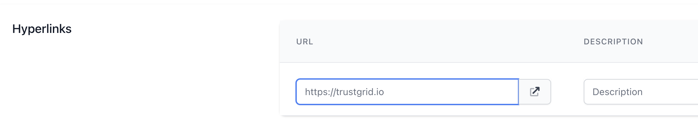
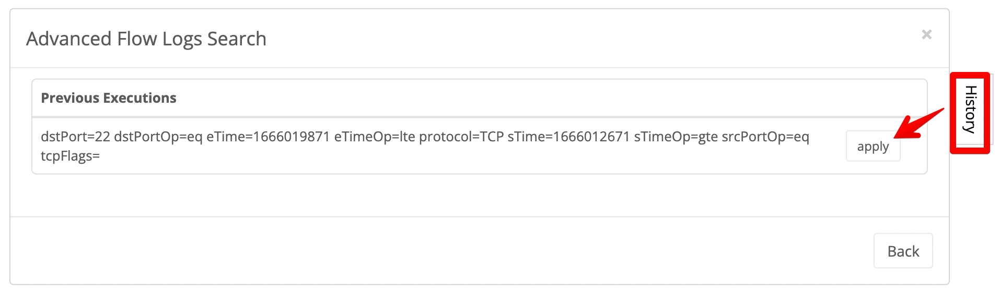
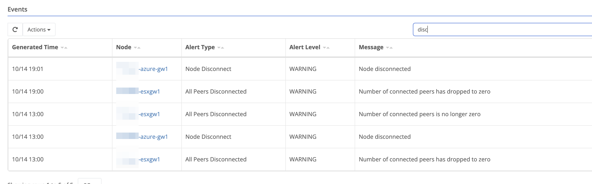

## Order Management Improvements

This release is primarily focused on making improvements to our order management system.

### Notification of Changes in Open Orders

Previously if more than one user was making changes to the same order it was possible the second user to save would overwrite the changes of the first. 

Now the system will notify you if someone has changed an order while you have it open. You would then need to refresh the page to see the changes made.

### Priority Field

Orders can now be assigned a priority of Normal, High or Urgent. This will be reflected in the Orders table by changing the color of the summary to yellow for High priority and red for Urgent.


  

  
  

  


### Support for Hyperlinks

You can now add Hyperlinks within an order to provide support documentation on the configuration.





### “In Production” Orders moved to Closed

Now when an order’s status is changed to `In Production`, it will appear in the `Closed` page of orders.  This will make is easier to see how many open orders are in process. 

## Other Improvements

### Advanced Flow Log Search History

You can now load a history of your previous Advanced Flow Log searches by clicking the history tab to the right.  You can then choose to reload a prior search’s parameters by clicking the apply button.

### Events Table Search

The Events table now has a search field that will filter the events shown.  This has been added both at the Node Detail Events page and under Operation to see events across all nodes in the org. 

