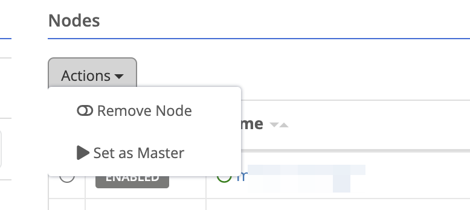
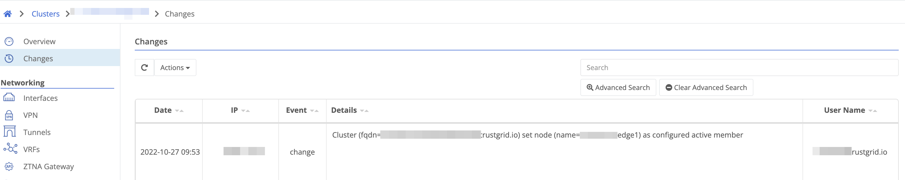

## Repository Performance Improvements

This release includes a significant overhaul of the the repository control plane service. This service is responsible for providing upgrade packages and pushing/pulling container images. 

## Data Plane Stats for Private and Hub Gateways

Prior to this release, viewing the Data Plane stats such as tunnel latency and [network hops]( would not display. These stats will now be displayed the just like edge and public gateway stats.

## Changing Configured Master (Active) Logging

With this release, if a user changes which node is configured as the master (active) member of the cluster it will be logged on `Changes` for the cluster.









