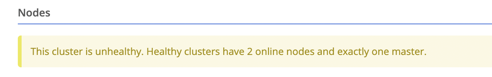
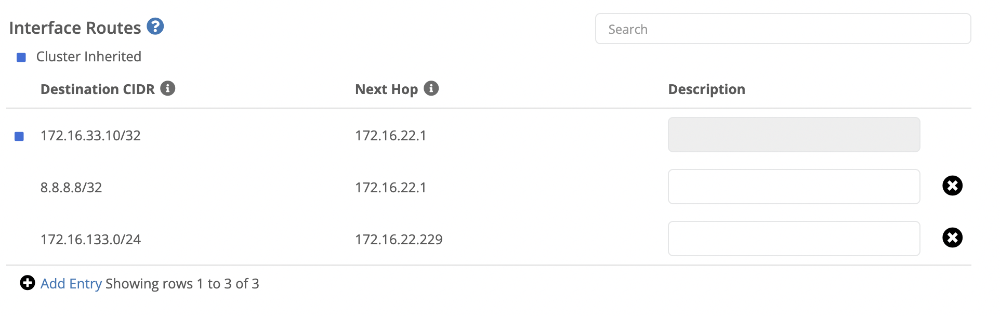

## Cluster Improvements

### Cluster Site Health State

With this release we introduce the concept of [Cluster Site Health State](). This addition makes it more obvious when there is an issue with a cluster at a site and possible to configure [alarm filters]() to notify your team when changes occur. 

We display the cluster health on the list view:

And on the cluster overview:


  

  
  

  


### Cluster Status Endpoint

When placing a load balancer in front of a Trustgrid cluster it is necessary to give the load balancer a way to determine which node is active so that it can send the traffic appropriately.   We’ve added an optional HTTP endpoint that will listen on cluster members but will only return a 200 code on the active member of the cluster. 

There is now a new section under System → Cluster for cluster members where you can define the port on which the node will listen. This endpoint will always listen on the WAN interface IP. 

> Requires node version 20220808 or newer

### Enable Different Interface Routes for Cluster Members 

Traditionally, cluster members share the interface routes configured at the cluster level.  This is usually desirable, but certain situations can require each member to have a different route defined.  For example, If you have deployed your cluster members in different AWS Availability Zones for redundancy and you have the [heartbeat communication]() on a LAN interface each would need a different route.  

With this release you will see the ability to “Add Entry” for additional routes under the LAN interface section of cluster members.  You will also see a read-only entry with a blue square for any cluster-defined route. 

## Data Plane Panel Improvements

### Easier Peer Selection

Previously, to select a node in the data plane peers table you had to click exactly on the node’s name.  Now, you can click anywhere in the name box. 

### Display Data Plane Stats for Gateways

Prior to this release we only displayed Tunnel Latency and [Network Hops]() (when enabled) on edge node devices. With this release you can now navigate to a gateway’s data plane panel and select a client edge node.  The data displayed is based on the edge node’s perspective but can still provide useful information on the state of the connection between devices.

## Other Improvements

### Flow Log Advanced Search by TCP Flags

The Flow Log Advanced Search now has the ability to search for TCP flows with specified TCP flags. In the TCP Flag section just click the flags that you want to search for and the matching flows will be returned. If multiple flags are selected, only flows with all matching flags will be returned.

### Node Audits Shows Node Version Changes

When a node is upgraded and successfully reconnects, the Node Audits section will display the new and previous versions. 

### Swagger API Improvements

A number of new areas are now documented in our public swagger documentation: https://portal.trustgrid.io/api-docs/

The new sections include:

* Additional Audit endpoints
* Container and VM configuration 
* ZTNA Gateway

