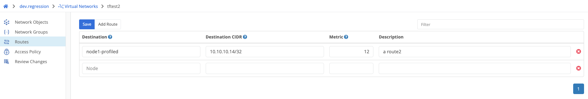

{}
Routes are used to allocate a portion of the virtual network overlay address space to a specific site (edge or gateway node).  All traffic destined for that subnet is then routed to the appropriate node and through the use of NAT (network address translation) is forwarded to the destination host on the local network. 
{}

The example below will walk through adding routes for new Trustgrid Node. This can be either a single node or a cluster.  If it is a cluster then the routes need to be pointed to the cluster rather than either of the individual nodes. 

1. In the Trustgrid portal, navigate to the domains page, and select the `Virtual Networks` page.
2. Next, select the virtual network you wish to add a route to.
3. To add a Route, click `Add Route`

4. Fill out the text boxes with the desired information. This includes the `Destination`, the `Destination CIDR`, the `Metric` value, and a relevant description.

5. At any point if you wish to delete the route, just click the :x: directly beside the route.