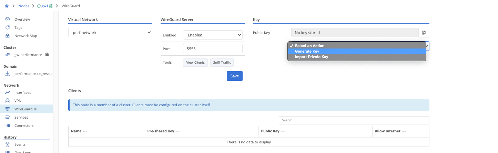
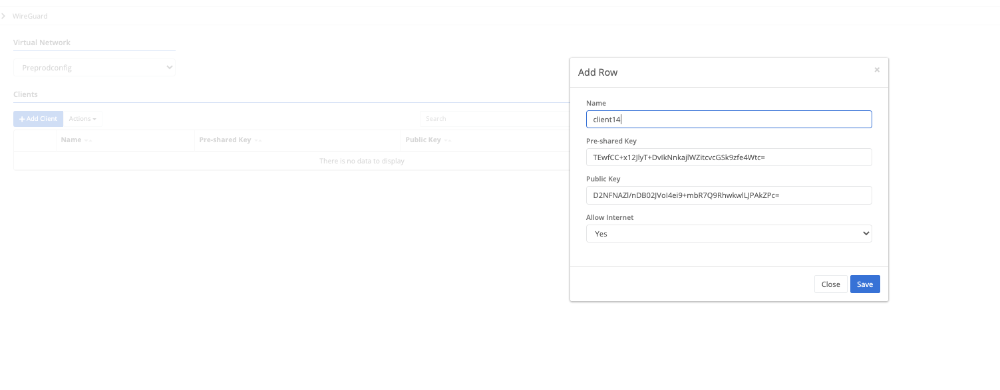
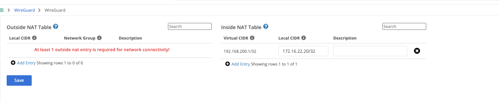
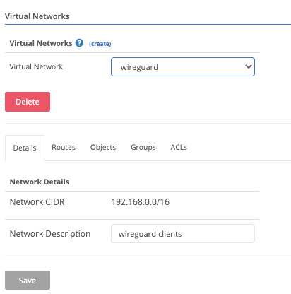

This describes the process of deploying a WireGuard client which will act as a Trustgrid Edge node connecting to a Trustgrid gateway routing traffic for clients connecting via the WireGuard service. This process describes how to configure it using an Ubuntu Linux server.

1. Deploy Wireguard Service: https://linuxize.com/post/how-to-set-up-wireguard-vpn-on-ubuntu-18-04/

   Below is an example wireguard interface config for wg0. Per the above article, iptables rules need to be added to source nat the traffic to the wireguard interface address from all clients.

   ```
   [Interface]
   PrivateKey = QPuBCrqefTzPkF+QIMjADFOoWSI+4xFc33M697btnQ=
   Address = 172.16.22.10/24
   DNS = 8.8.8.8, 4.2.2.2
   [Peer]
   PublicKey = f85A1r4j3WWANBCTEIGNWLDMoqyepJWUmaDC4yVY=
   PresharedKey = K9g6ZZ/IXeZL1ACAUEVB2hgFir2AAfhBRaRWVhcJyA=
   AllowedIPs = 192.168.20.0/24
   Endpoint = 172.16.22.20:5555
   PersistentKeepalive = 30
   ```

   IPTables rules:

   ```
   sysctl -w net.ipv4.ip_forward=1
   iptables -A FORWARD -i wg0 -j ACCEPT
   iptables -t nat -A POSTROUTING -o wg0 -j MASQUERADE
   iptables -t nat -A POSTROUTING -o ens192 -j MASQUERADE
   ```

1. Enable the Wireguard Service on the Trustgrid Gateway and define the desired port. Also either generate or import the public key to be used

   

1. Configure the wireguard service as a client of the Trustgrid Gateway. If the gateway is a member of a cluster it will be configured under the cluster configuration options otherwise it will be configured on the individual gateway. Enter in the desired client name / the pre-shared key and public key generated on the wireguard server. Internet access can also be allowed if that is being configured on the gateway side.

   

1. Select the client that was added and configure the inside nat. The virtual CIDR should be within the virtual network space that the Gateway is attached to as seen below. This can be seen under domains > domain > virtual networks. The Local CIDR should be the wireguard interface address that is sourcing all traffic to the gateway. An outside NAT is not normally required.
   
   

1. Any hosts communicating with the remote networks on the gateway side will need to use the wireguard server interface as the next hop for reaching that network.

_"WireGuard" is a registered trademark of Jason A. Donenfeld._
