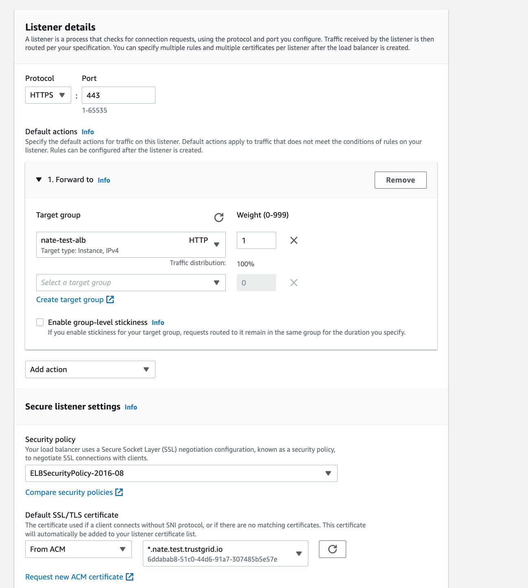

1. Create EC2 target group and add both Trustgrid application gateways with the target being TCP port 80.

The health check should be for http and the path should be `/status`

Only the active member of the Trustgrid Cluster will respond as healthy to this check. 

2. Create an ALB (Application Load Balancer) with the listener set to HTTPS and forwarding to the target group created above. Under secure listener settings apply the SSL Certificate provided by Trustgrid for the application gateways. `ELBSecurityPolicy-2016-08` is recommended as the default security policy by AWS.  

The load balancer should be created as internet facing IPV4 and mapped to the Public facing subnets of the Trustgrid gateways.

