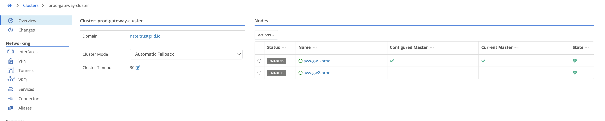
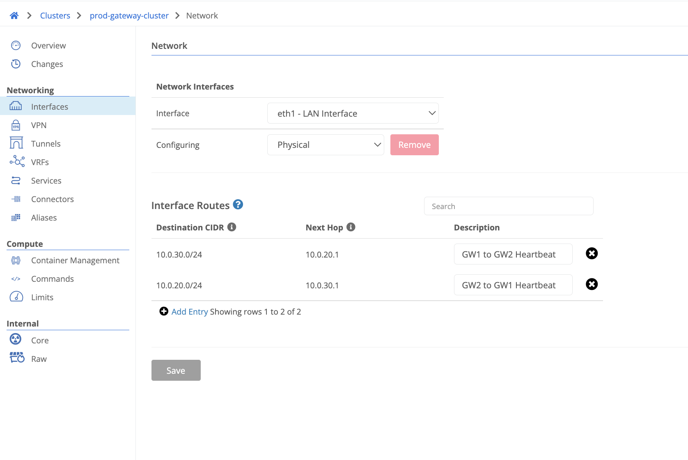

1. Deploy a pair of Trustgrid gateways. Deployment guide includes an example Cloud Formation template that can be used directly or customized for your environment or converted to Terraform if preferred. Gateways can be deployed in the same availability zone or different ones to provide greater redundancy across AWS. [Deploy a Trustgrid Node AMI in AWS]().

1. Under networking > clusters create a cluster using a descriptive and unique name as seen below.
   

1. Select the cluster that was created and add both gateways to it using the actions drop down button as seen below.
   

1. Configure the cluster heartbeat on each individual gateway node. This is located under system > cluster. The host should be the gateway interface on which you want to configure the heartbeat. This can be either the WAN facing or LAN facing interface. You can see what IP is configured from the node page under interfaces. The port defaults to TCP 9000 but can be any unused TCP port if desired. Security groups for both gateways will need to allow this communication in both directions. Both gateways send a heartbeat to each other on the configured IP and Port to determine if the other member is healthy. If the secondary is not able to get a response from the primary then it will become the active member of the cluster. Once this has been configured both nodes should show as green and healthy in the cluster as seen below.
   
   

   If deploying gateways in different availability zones then LAN interface routes will need to be added to the cluster for both gateway LAN subnets as seen below. This is to ensure the heartbeat communication is routed over the correct interface instead of going out the WAN interface. 

   

1. Under the cluster > interfaces > eth1 LAN > AWS Route Table Entries add the appropriate CIDR for the edge IP space. This should be the subnet that includes all virtual network IP space configured for edge node sites. For example if you have 100 different edge node sites carved out of 172.16.0.0/16 then you would just add this one CIDR. Once this has been added the route should be created in the routing table that is associated to the gateways LAN interface pointing to the ENI of the active member of the cluster.

   There is an IAM profile that should have been associated to each gateway outlined in the deployment guide providing them permissions to manage the routes defined in the AWS Route Table Entries. When a failover event occurs an API Call is made to update the route to point to the ENI of the active member of the cluster.

   This concludes the cluster configuration specifics for AWS deployment. Appropriate VPN configuration will need to be applied in order for traffic to pass end to end between the gateways and edge node sites.
