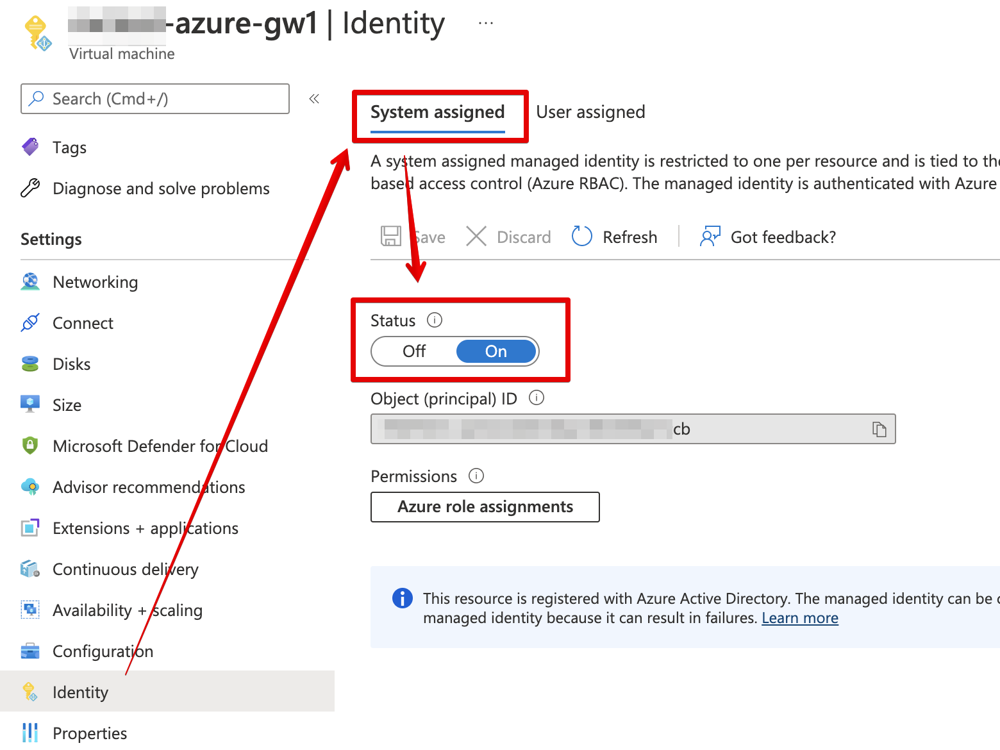
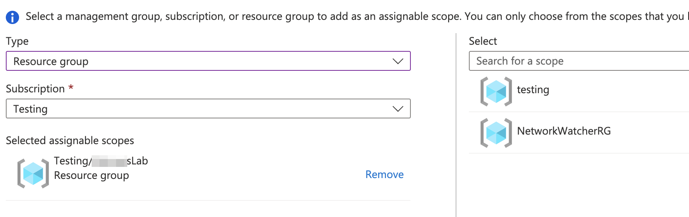
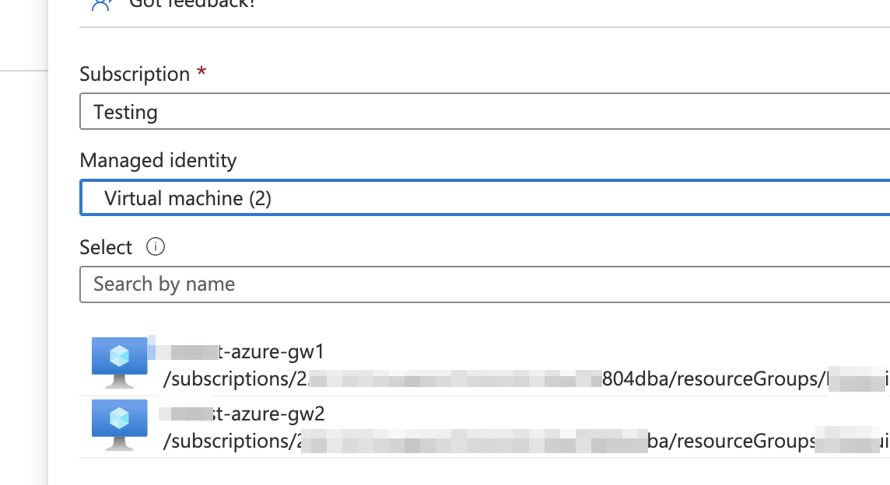

## VM Requirements

| Requirement | Description      |
| ----------- | ---------------- |
| OS          | Ubuntu 18.04 LTS |
| Disk Size   | At least 30 GB   |

### Instance Type

Trustgrid has validated using the [B-series burstable - Azure Virtual Machines](https://learn.microsoft.com/en-us/azure/virtual-machines/sizes-b-series-burstable) instance type.

VPN throughput is tied to CPU the recommended size depends on roles, expected throughput.

- For Gateway nodes expecting up to ~200Mbps throughput, Trustgrid recommends the Standard_B4ms or larger
- For Edge nodes expecting less than 100Mbps throughput, Trustgrid recommends the Standard_B2s or Standard_B2ms or larger

### Interfaces

One WAN interface with a public IP and one LAN interface on a private subnet. The nodes will need to be able to route to all required hosts/applications that need to communicate across the Trustgrid virtual network.

The LAN interface needs to have **IP Forwarding Enabled** in order to forward the traffic across the tunnel.

See [Azure virtual network traffic routing](https://learn.microsoft.com/en-us/azure/virtual-network/virtual-networks-udr-overview).

### Network Access

> During deployment only, Trustgrid will need direct SSH access from their provisioning system to the VM instances that will be converted into Trustgrid nodes.

For gateways:

- Outbound internet access to the [Trustgrid control plane networks]() and ability to resolve public DNS names.
- Inbound access required is the TCP port defined for the Trustgrid gateway service to listen on. Edge nodes will connect to the gateways public IP and port defined. The default port used is 8443.

For edge nodes:

- Outbound internet access to the [Trustgrid control plane networks](), outbound access to the IP and ports of the Trustgrid gateways, and ability to resolve public DNS names.
- No inbound access is required on the public interface.

For all clustered nodes:

- The cluster heartbeat runs on the LAN/inside interface on TCP Port 9000. This port will need to be open between both Trustgrid Gateways for failover to work correctly.

### Admin Username and SSH Key

Trustgrid requires SSH access to the deployed VM to complete the Trustgrid deployment process. After the deployment is complete the VM ceases to listen on port 22 and any external access to that port can be revoked.

- Username: `ubuntu`
- SSH public key:

  
  ssh-rsa AAAAB3NzaC1yc2EAAAADAQABAAABAQDK1AHNLfqOd13qsWQGa4FgoNcpllJYlIlkJdqCkLFq0qaYVrh0b1mxalVzrrxy8rSj7DYlofRArb9hntijLnkrlKxMcWVgqMg4JAcXEQvWUtkIwFemE/NoZoXncKfr6lJZ/+gT1LhNX7IMUh7vVhYsyhDkbdvU0FcnJVelEW5TCRdPLzTMcbRfjCo6MiCoMK45nQIKRHofAJFPSubmPAKZC0L1Dz4zwnb1PeCadSDRHDwPWB3vCl9H/h+7Oe7TC+kEc4bV8OzZTnzfX4Mdo9rb9Afz3ZFWYYh3KP2v1hsF6rtSLS6EpuMZVS41YHvGpHQjFgn0n8hNIoQvf9gO4hxH
  

## Requirements for HA Failover

### Azure Routing Table

An Azure routing table resource needs to be associated with the LAN interface's subnet.

#### View LAN Subnet Routing Table

1. In the Azure Portal search for Virtual Networks and select the service
1. From the list of Virtual Networks select your target Virtual Network
1. From the navigation panel select Subnets
1. Select your inside/private subnet that is attached to the LAN interface of your Trustgrid VMs
1. There should be a route table

   

#### Create Route Table for LAN Subnet

1. If there is no Route Table associated with your LAN/inside/private subnet you will need to add it.
1. In the Azure portal search for Route Tables and select the service
1. Click the +Create button
1. Select the Resource Group that contains your Virtual Network and VMs
1. Select the Region that your VMs are deployed in
1. Give the Route Table a name consistent with your naming conventions
1. (Optional) change the Propagate Gateway routes option.

   

1. Click Review + Create, review then click Review + Create again
1. Repeat the above steps to “View LAN Subnet Routing Table” and change the route table from None to the newly created Route Table.
1. Save the change

### Permissions Required for Cluster Route Failover

Copy this sample json file for use in creating a custom role with the required permissions. See process below.

> The assignableScopes section will need to be modified to represent the resource information of the target Azure account.


{
	"properties": {
		"roleName": "tg-route-table",
		"description": "manage azure route table",
		"assignableScopes": [
		],
		"permissions": [
			{
				"actions": [
					"Microsoft.Network/networkWatchers/nextHop/action",
					"Microsoft.Network/networkInterfaces/effectiveRouteTable/action",
					"Microsoft.Network/routeTables/routes/delete",
					"Microsoft.Network/routeTables/routes/write",
					"Microsoft.Network/routeTables/routes/read",
					"Microsoft.Network/routeTables/join/action",
					"Microsoft.Network/routeTables/delete",
					"Microsoft.Network/routeTables/write",
					"Microsoft.Network/routeTables/read",
					"Microsoft.Network/networkInterfaces/read",
					"Microsoft.Network/virtualNetworks/read",
					"Microsoft.Compute/virtualMachines/read"
				],
				"notActions": [],
				"dataActions": [],
				"notDataActions": []
			}
		]
	}
}


1. [System-assigned Managed Identity](https://learn.microsoft.com/en-us/azure/active-directory/managed-identities-azure-resources/qs-configure-portal-windows-vm) needs to be enabled for both VMs in the cluster.

	

1. A custom role needs to be created in the Azure subscription that allows the Trustgrid nodes to update the route table when failover occurs
	1. Create the custom role
		1. In the Azure portal search for “Subscriptions” and select the Subscriptions service
		1. Select the subscription that contains the Trustgrid VMs 
		1. Select “Access control (IAM),” then click “+Add”, then “Add custom role”

			

		1. Save the JSON above to a file named `azure-custom-role-sample.json`.
		1. Select “Start from JSON” and from the file selector, select the downloaded json file.

			

		1. Optionally, update the role name to meet your internal naming conventions.
		1. Click `Next`. 
		1. On the Permissions page you will see the permissions that will be granted. Click `Next` again.
		1. On the Assignable Scopes page click +Add Assignable Scope
			1. From the Type select Resource Group
			1. From the Subscription, select the subscription your VMs and virtual networks are in.
			1. From the Select pane on the right search for and select the Resource Group containing you VM’s

				

			1. Click `Select` and then `Next`.
		1. On the JSON page, click the `Next` button.
		1. Click Review + Create, then click Create.

1. Assign the custom role to your Trustgrid VM’s system-assigned
	1. In the Azure portal search for Resource Groups and select the service
	1. Select your target Resource Group
	1. Select the Access Control (IAM) panel, then click +Add, then “Add role assignment”

		

	1. Search for and select the desired role and click Next

		

	1. Under “Assign access to” select “Managed Identity” then click +Select members

		

	1. From the Managed Identity dropdown select Virtual Machine
	1. Select the identity for your first Trustgrid VM

		

	1. Click select. 
	1. Click +Select members again and repeat with your second Trustgrid VM
	1. Click “Review + Assign” then “Review + Assign” a second time

> These permissions can take some time to go into effect.

## Deployment Process

The current deployment process involves Trustgrid and the site’s technical team with Azure access working together to complete converting a standard Ubuntu 18.04 LTS based VM into a Trustgrid Appliance (or appliances for a clustered deployment).

### Participants

* Site Tech - User(s) with permissions to deploy new instances in Azure, create the required Managed System Identity shown above, and make changes to allow the required network connectivity
* Trustgrid Tech - Trustgrid professional services team member that will complete the conversion of the generic image into a 

> If the Site Tech is not part of the organization that is Trustgrid's direct customer, Trustgrid will need documented approval from that customer before proceeding with assisting in the deployment.

### High-Level Process

1. Prior to a scheduled call the Site Tech can:
	1. Build a vNet with public and private subnets if it does not already exist
	1. Create the Managed System Identify permissions as defined above
	1. Create VM Instances based of the Ubuntu 18.04 LTS image and sizing requirement mentioned above
1. A conference call will be scheduled between the Site Tech and Trustgrid Tech during business hours
1. During the conference call:
	1. Trustgrid Tech - 
		1. Confirm connectivity to the node
		1. Run automation process to convert into Trustgrid appliance
		1. Register the device with the target organization
		1. Confirm healthy functionality and connectivity to the required
		1. Configure and test clustering including route failover (if clustering is to be used)
		1. Configure VPN (if to be used) and confirm access to required networks/hosts if possible
	1. Site Tech - 
		1. Revoke direct SSH access
