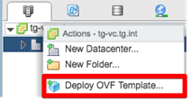
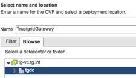
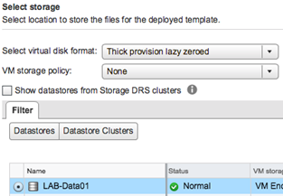
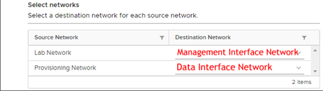

## Requirements

### Hardware Resources

* 4 vCPU
* 4 GB RAM
* 30 GB disk space

### Software Requirements

* vSphere 6.7 or newer (with VMWare support)

## Configuration Requirements

### Backups

Trustgrid recommends against backing up virtualized Nodes.  Backups that utilize VMware's Data Protection API will initiate a VM Snapshot that will pause all traffic through the VM for a short period of time.  This can cause issues such as master failover in a cluster and disruption of existing network flows.

In place of backups Trustgrid recommends deploying clustered nodes on different ESX hosts if possible. Nodes can be redeployed and rapidly configured as the configuration is stored in our cloud management system.

### Dynamic Resource Scheduling (DRS) and Storage DRS

#### Automation Level

Trustgrid recommends setting the DRS level for a VM to either Partially Automated or Disabled.  Even the temporary loss of network connectivity during vMotion migrations can disrupt some network flows.

* [Set a Custom Automation Level for a Virtual Machine](https://docs.vmware.com/en/VMware-vSphere/6.5/com.vmware.vsphere.resmgmt.doc/GUID-C21C0609-923B-46FB-920C-887F00DBCAB9.html)
* [Change Storage DRS Automation Level for a Virtual Machine](https://docs.vmware.com/en/VMware-vSphere/6.7/com.vmware.vsphere.resmgmt.doc/GUID-B560341B-B377-4FA7-BF3B-98A4788AAE3A.html)

#### (Recommended) Anti-Affinity

If you have Trustgrid nodes clustered within a vSphere Cluster with DRS enabled you should create an anti-affinity rule.  This rule should keep the nodes running on independent hosts for additional hardware redundancy.

* [Create VM Anti-Affinity Rules](https://docs.vmware.com/en/VMware-vSphere/6.7/com.vmware.vsphere.resmgmt.doc/GUID-FBE46165-065C-48C2-B775-7ADA87FF9A20.html#GUID-FBE46165-065C-48C2-B775-7ADA87FF9A20)

## Deployment Process

The Trustgrid gateway node can be deployed in a vSphere environment (v6.7 and higher) using a custom VM template provided by Trustgrid.  Follow the instructions below to deploy the OVF template in your environment.

1. Download & Extract the customized VM template from the link sent to you by Trustgrid
1. Open & log in to your vSphere web client
1. Navigate to Host & Clusters

1. Right click on vSphere ESX host in the Navigator pane and select Deploy OVF Template

	

1. Select Local File and then click Browse 

	

1. Select all of the files included in the zip file and click open, then click Next

1. Confirm the name and desired location for your VM and click Next

	

1. Select a resource to place your VM on and click Next

	

1. Click Next on the Review Details pane

	

1. Select your preferred storage options and click Next

	

1. Select the proper networks for your network interfaces. 

	

	* The destination network for the first network interface will be the network designated for the node’s management interface. If you opted for a single interface configuration, you will only need this interface connected.
	* The destination network for the second network interface will be the network designated for the node’s data interface. If you opted for a single interface configuration you will still need to provide a port group for this to complete the deployment but it can be disconnected after deployment

1. Verify the configuration data and click Finish to deploy the VM

	

1. Once your VM Template has finished deployment, power on the VM

Deployment of your Trustgrid gateway node VM is now complete.  If configuring this Node as a gateway, the next step will be to allow inbound TCP port 8443 to your gateway VM to allow remote nodes to connect back to it.

