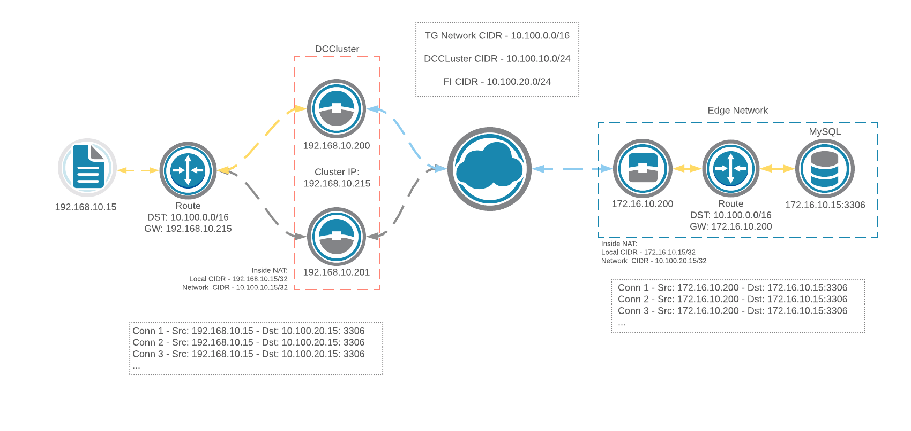
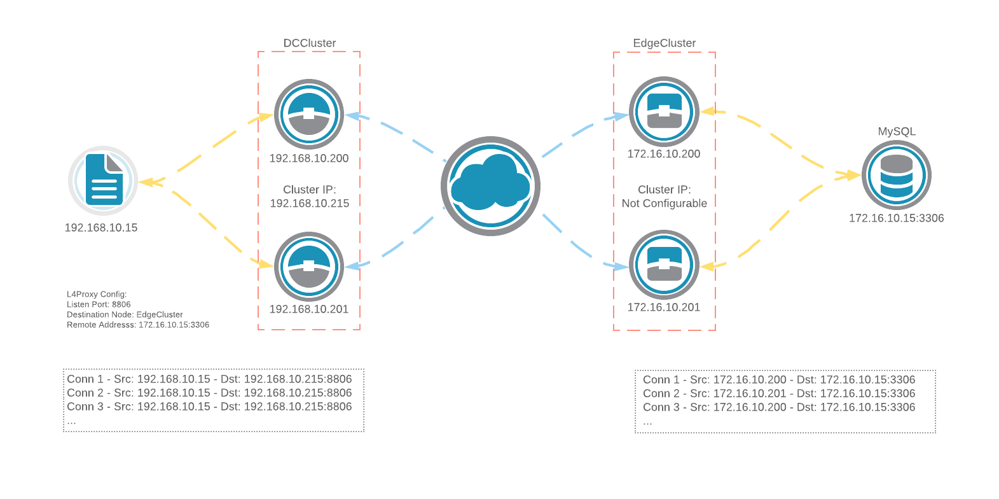

{}
Edge nodes can be configured in an "on a stick" configuration, in which only a single NIC is used for each node. Operating in this mode is supported only when using Layer 3 or Layer 4 configuration where hosts behind gateway nodes need access to data behind edge nodes.
{}

In this configuration, the source IP of traffic from the edge node depends on whether Layer 3 or Layer 4 is being used, as illustrated below.

### Layer 3

Traffic will originate only from the current active node from the IP address(es) specified in outside NAT rules in the edge node's config.

### Layer 3 - routed single edge node

Trustgrid node(s) used as the next hop in a route for the Trustgrid virtual network. Traffic at the edge will originate from the node's IP address.

### Layer 4

Traffic will originate from either edge node with round-robin load-balancing with the source IP address being the IP address of whichever node the traffic originates from.

