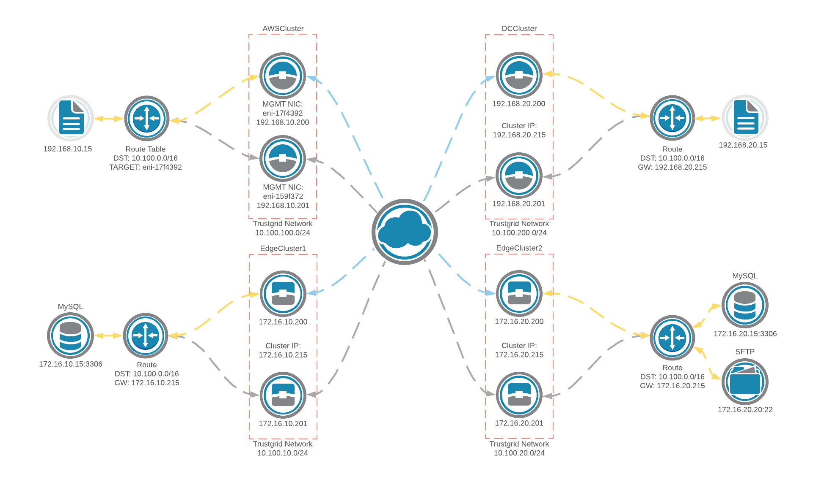

In this scenario, a clustered pair of active/passive edge nodes at each edge location connects to a pair of active/passive clustered gateway nodes in both an AWS VPC and a data center with layer 3 routed between the edge locations and the hybrid cloud.

This configuration allows for the loss of one node at each site without a loss of connectivity between the edge location and the hybrid cloud. Clustered nodes at the edge locations and the data center use a shared IP. The clustered nodes in the AWS VPC maintain the correct ENI as the target for the route to the Trustgrid network in the VPC route table to allow traffic to continue to flow in the event of a failover on any of the nodes. Failback to the original active cluster member happens when the node recovers from the event that caused the failover, and on the data center or edge nodes the shared IP is switched back to the original active node. 

Failback on AWS nodes triggers an update of the route table to set the target for the route to the Trustgrid network back to the ENI of the data NIC on the original active cluster member. Inside NATs are used to translate local IP addresses to IP addresses on the Trustgrid network.  

A route is added in the core router at the data center and edge locations for the Trustgrid subnet with the next hop set to the shared IP of the clustered nodes in each location. Inside NATs are used to translate local IP addresses to IP addresses on the Trustgrid network.  

### Network Information

| Local Network CIDR | Location |
| ------------------ | -------- |
| 192.168.10.0/24	| AWS VPC Subnet |
| 192.168.20.0/24 | Data center |
| 172.16.10.0/24 | Edge location 1 |
| 172.16.20.0/24 | Edge location 2 |

### Route Configuration

In this example, the Trustgrid network is `10.100.0.0/16`.

| Trustgrid Network CIDR | Destination Node |
| ---------------------- | ---------------- |
| 10.100.100.0/24 | DCCluster |
| 10.100.200.0/24 | AWSCluster |
| 10.100.10.0/24 | EdgeCluster1 |
| 10.100.20.0/24 | EdgeCluster2 |

### Inside NAT Configuration

| Local CIDR | Network CIDR | Node | Description |
| ---------- | ------------ | ---- | ----------- |
| 192.168.10.15/32 | 10.100.100.15/32 | AWSCluster | Application server behind AWSCluster nodes |
| 192.168.20.15/32 | 10.100.200.15/32 | DCCluster | Application server behind DCCluster nodes |
| 172.16.10.15/32 | 10.100.10.15/32 | EdgeCluster1 | MySQL server behind EdgeCluster1 nodes |
| 172.16.20.15/32 | 10.100.20.15/32 | EdgeCluster2 | MySQL server behind EdgeCluster2 nodes |
| 172.16.20.20/32 | 10.100.20.20/32 | EdgeCluster2 | SFTP server behind EdgeCluster2 nodes |
