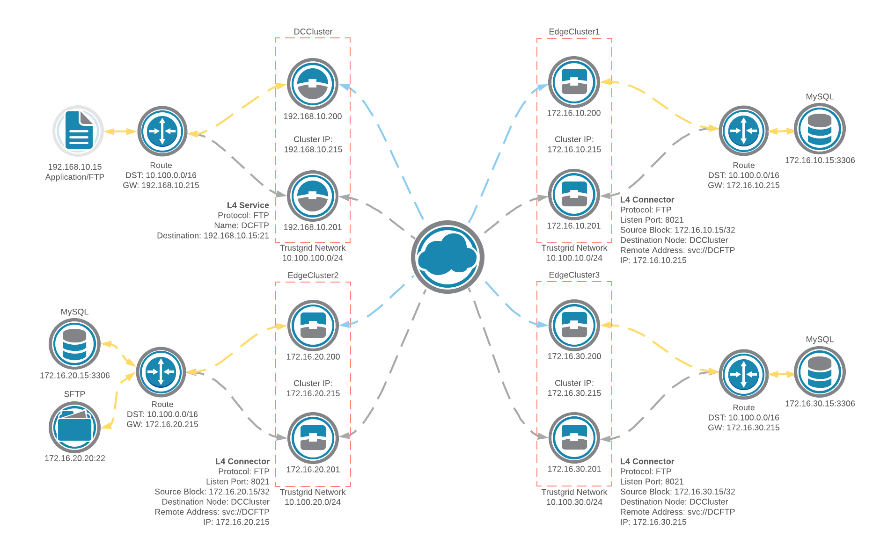

In this scenario, a clustered pair of active/passive edge nodes at each edge location connects to a pair of active/passive clustered gateway nodes at the data center. Layer 3 is utilized to allow an application server at the data center to access data at the edge location and a layer 4 service and connector is used at the edge locations to provide connectivity to an FTP service back at the data center.  

This configuration allows for the loss of one node at each site without a loss of connectivity between the edge location and the data center. Upon node failover, the active cluster member is switched to the second node and the shared IP address follows, allowing traffic to continue to flow using the second node. Failback to the original active node happens when the node recovers from the event that caused the failover and the shared IP is moved back to the original node at that time.

A route is added in the core router at the data center and edge locations for the Trustgrid subnet with the next hop set to the shared IP of the clustered nodes at each location. Inside NATs are used to translate local IP addresses to IP addresses on the Trustgrid network for layer 3 traffic. The L4 service on the data center node is configured so that L4 traffic to the FTP server will show up with the source IP as the shared IP for the cluster.  The listening port of the L4 connector is accessible via the shared IP on the edge nodes, allowing for high-availability of the L4 connector.  

### Layer 4 Configuration

#### Service

| Protocol | Name | Destination | Description |
| -------- | ---- | ----------- | ----------- |
| FTP | DCFTP | 192.168.10.15:21 | FTP access on DC application server |

#### Connector

| Protocol | Listen Port | Source Block | Destination Node | Remote Address | IP | Description |
| -------- | ----------- | ------------ | ---------------- | -------------- | -- | ----------- |
| FTP | 8021 | <CIDR of edge server> | DCCluster | svc://DCFTP | <Cluster shared IP> | L4 connector for FTP access from each edge node |

### Network Information

| Local Network CIDR | Location |
| ------------------ | -------- |
| 192.168.10.0/24	| Data center |
| 172.16.10.0/24 | Edge location 1 |
| 172.16.20.0/24 | Edge location 2 |
| 172.16.30.0/24 | Edge location 3 |

### Route Configuration

In this example, the Trustgrid network is `10.100.0.0/16`.

| Trustgrid Network CIDR | Destination Node |
| ---------------------- | ---------------- |
| 10.100.100.0/24 | DCCluster |
| 10.100.10.0/24 | EdgeCluster1 |
| 10.100.20.0/24 | EdgeCluster2 |
| 10.100.30.0/24 | EdgeCluster3 |

### Inside NAT Configuration

| Local CIDR | Network CIDR | Node | Description |
| ---------- | ------------ | ---- | ----------- |
| 192.168.10.15/32 | 10.100.100.15/32 | DCCluster | Application server behind DCCluster nodes |
| 172.16.10.15/32 | 10.100.10.15/32 | EdgeCluster1 | MySQL server behind EdgeCluster1 nodes |
| 172.16.20.15/32 | 10.100.20.15/32 | EdgeCluster2 | MySQL server behind EdgeCluster2 nodes |
| 172.16.20.20/32 | 10.100.20.20/32 | EdgeCluster2 | SFTP server behind EdgeCluster2 nodes |
| 172.16.30.15/32 | 10.100.30.15/32 | EdgeCluster3 | MySQL server behind EdgeCluster3 nodes |
