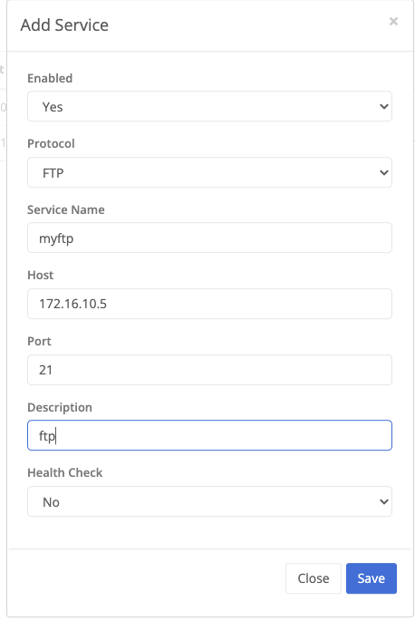

## FTPS & FTPS Using Layer 3

FTP & FTPS are supported in passive mode when using layer 3. This configuration requires the FTP server to be configured with the external IP address in the passive settings set to the Trustgrid virtual IP that corresponds to the FTP server.

FileZilla passive mode settings:

## FTP Using Layer 4

FTP is supported in passive mode when using L4 Proxy, however FTPS is not. To configure FTP access through L4 Proxy, the Outbound L4 Service and/or L4 Connector need to be configured with FTP set as the protocol as shown below:

