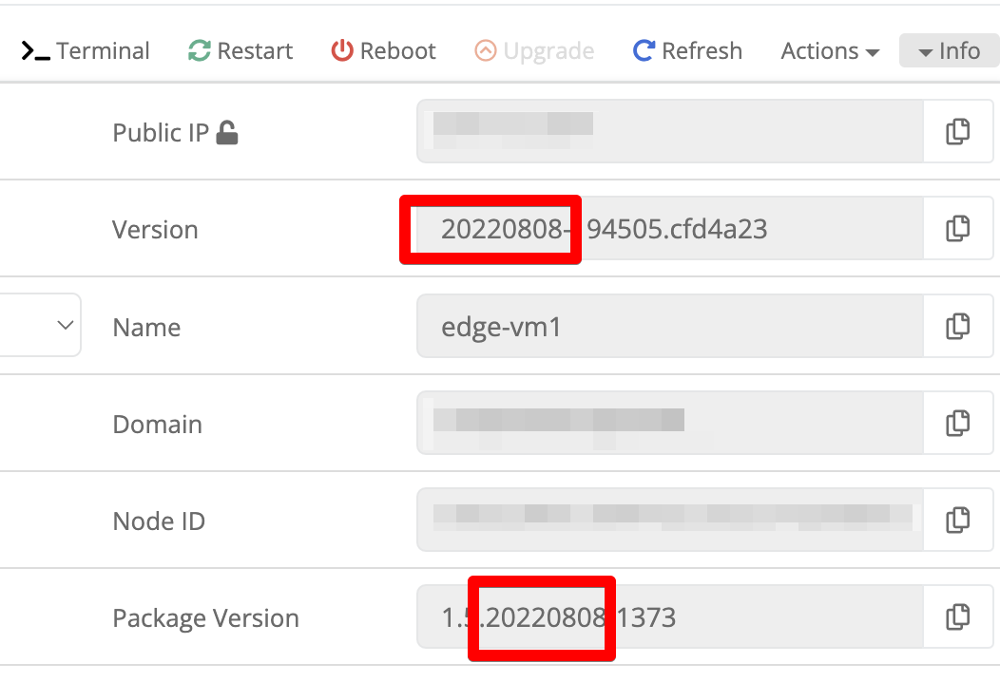
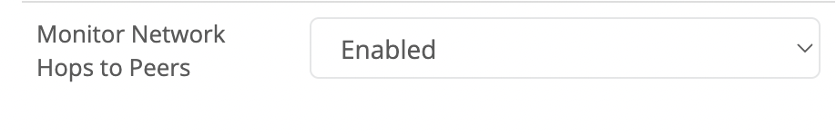
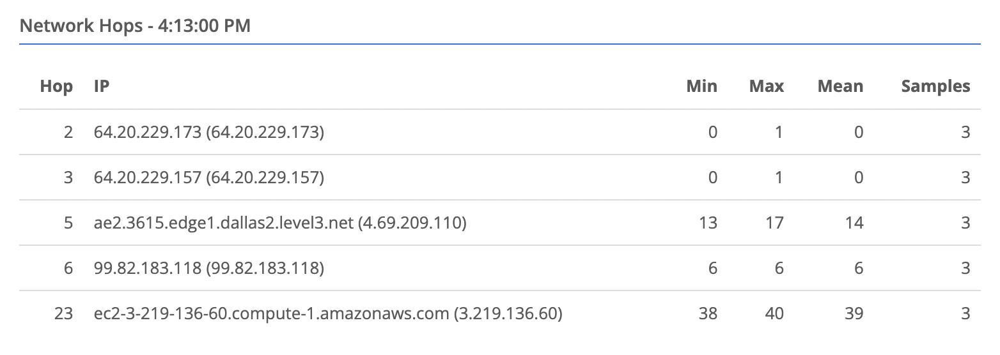
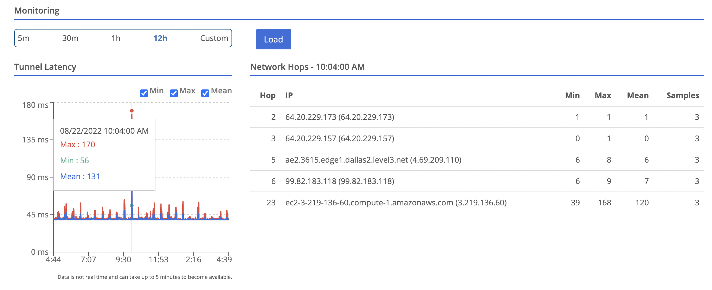

{}
This feature collects traceroute-like data to all its connected peers and stores the results in the Trustgrid cloud for historical review.  
{}

Network hop monitoring requires version 20220808 or newer to gather the required data.

## How it Works

1. The node will send out packets to each peer's public IP and port (if a gateway) with incrementing Time To Live (TTL) values.
1. As the packets pass through each router (or hop) along the way the TTL is decreased by one.
1. Any time a router receives a packet with at TTL with the value 1 it will drop the packet and can reply with an ICMP packet saying “Time to Live has been exceeded”
1. The node uses these ICMP packets to calculate latency to each hop.

## Known Limitations

There are several known limitations with gathering this data:

- Routers on the internet are not required to respond with ICMP. This will lead to gaps in the Hop numbers.
- Those that do respond sometimes deprioritize their response which leads to misleading latency numbers.
- - If you see a hop with high values, but the the values for higher hop numbers is normal this is not likely the cause of problems
- - **If a hop has high values and all subsequent hops have higher values this is likely the source of the latency/loss**
- Firewall rules have to allow the packets and the responses.
- - By utilizing the same TCP port as the gateway, all data collected from edge nodes should be allowed out.
- - Some firewalls/routers have trouble correlating the TCP request with the ICMP response which leads to no data
- Gathering this data requires compute resources on the node and the gateway. Trustgrid recommends only enabling on edge nodes that have frequent latency or packet loss issues as a troubleshooting tool.

It is not recommended to enable this feature on public gateways or private gateways with a large number of clients

## Enabling Network Hop Monitoring

1. Navigate to the node you want to enable
1. Verify there version is 20220808 or higher 
1. Navigate to `Gateway` under the `System` section
1. Enable `Network Hop Monitoring` and click `Save` 

## Special Considerations

### Azure Nodes

If you enable this on an **edge** node running on an Azure VM, the default security group rules will prevent responses from intermediate hops on the path. You will still get data from the final hop, which is the target gateway.

You will need to add an inbound rule to the node's public interface network security group.

The rule needs the settings shown below:

The rule has to allow the destination of any which is not without risk. Make you weight the risks and benefits and are aware what VMs in Azure are using the same security group.

## Viewing Network Hop Data

1. Navigate to the node you want to view
1. Select `Data Plane` on the left
1. Select the peer you wish to view data for. You will see a table of hops appear in the bottom right. 
1. You can select a time point on the latency chart, and the hops table will update to show the data for that time point. 
