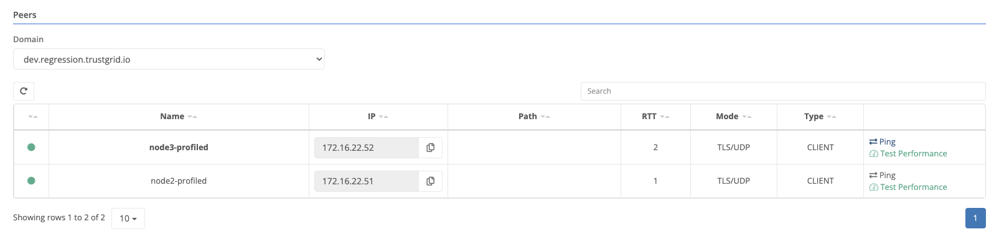
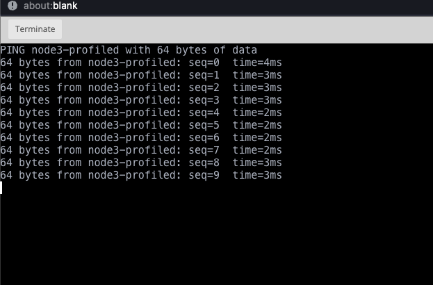

{}
This tool runs a ping from the gateway node to a remote edge node to verify the Trustgrid overlay network is functioning as expected.
{}

## Usage

1. Navigate to the node from which you want to test connectivity.
1. Click the `Data Plane` link on the left hand side.
1. Among the gateways (in the case of an edge node) or edge nodes (in the case of a gateway), click `Ping` on the row of the node you want to test.

   

1. A modal will pop up with options. Click `Execute` to start the ping.

   

1. A window will pop up with the ping output. You can adjust the interval to change the time between pings (in seconds), and the size to change how much data is sent.

   
