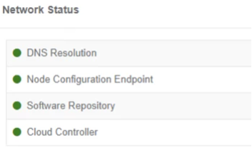

{}
The Trustgrid UI can be used to change the management IP or DNS servers configured on the Trustgrid node. It can also be used to confirm connectivity of the device to various Trustgrid services.
{}

###### Requirements:
1. Physical access to the Trustgrid Node
2. Laptop or Desktop with web browser (preferably Chrome) and network card (NIC)
3. Ethernet Cable 

###### Steps to Access the Trustgrid UI to Update Management IP or DNS Servers:
Local UI IP addresses

<table>
<thead>
<tr>
<th>Interface Label</th>
<th>Local UI Website</th>
<th>Attached Device IP</th>
</tr>
</thead>
<tbody>
<tr>
<td>
Netgate - ETH1 
Lanner 1210 - LAN2 
Lanner 1515 Fiber WAN -SPF2  
Lanner 1515 RJ45 WAN - SPF1  
</td>
<td>https://169.254.<strong>1</strong>.234</td>
<td>169.254.<strong>1</strong>.1/24</td>
</tr>
<tr>
<td>
Lanner 1210 - LAN3  
Lanner 1515 Fiber WAN - LAN3  
Lanner 1515 RJ45 WAN - SFP2  
</td>
<td>https://169.254.<strong>2</strong>.234</td>
<td>169.254.<strong>2</strong>.1/24</td>
</tr>
<tr>
<td>
Lanner 1210 - LAN4  
Lanner 1515 Fiber WAN - LAN4  
Lanner 1515 RJ45 WAN - LAN4  
</td>
<td>https://169.254.<strong>3</strong>.234</td>
<td>169.254.<strong>3</strong>.1/24</td>
</tr>
<tr>
<td>
Lanner 1515 Fiber WAN - LAN5  
Lanner 1515 RJ45 WAN - LAN5  
</td>
<td>https://169.254.<strong>4</strong>.234</td>
<td>169.254.<strong>4</strong>.1/24</td>
</tr>
<tr>
<td>
Lanner 1515 Fiber WAN - LAN6  
Lanner 1515 RJ45 WAN - LAN6  
</td>
<td>https://169.254.<strong>5</strong>.234</td>
<td>169.254.<strong>5</strong>.1/24</td>
</tbody>
</table>

1. Disable the node in the Trustgrid Portal. This will disrupt and disable all data plane communication on the node. 
2. Make sure the ETH0/LAN1 interfaces is connected to a network device.

    a. Ideally connected to the desired switch port so we can confirm status after changes, but at minimum it must have "link"
3. Reboot the Trustgrid Node by power cycling the device 
4. Connect your laptop/desktop NIC to one of the available interfaces (refer to the table above)
5. Configure a laptop/desktop NIC with the corresponding "Attached Device IP" from the table above 
6. In a web browser (Chrome preferred) navigate to the corresponding Local UI Website from the table above. Note: you will get an SSL warning which is safe to accept the self-signed certificate 
7. On a successful connection, you will be at the Trustgrid UI Login Screen. The username is "admin" and the password is the mac address (lowercase) listed on the sticker on the bottom of the node as seen below. This must include colons between every two characters. For example the password for the device pictured below would be 00:08:a2:0b:cd:30 all lowercase.

 

1. Upon successful login you will see the `Network Status` page shown below. This shows the current connectivity status of various Trustgrid services. Green means connectivity is established and red means it is not. 

1. Select `Management Interface` (shown below) on the left hand side of page. You can then edit the IP Address/Netmask/Gateway and DNS Servers configured. Once the relevant changes have been made click on `Apply` and then click `Save`.

1.  Check the network status page to see if the Trustgrid services turn green. If they do then cable the node back as expected. 

2.  Contact Trustgrid support and communicate the IP information configured above so they can update the configuration in the portal and enable the node.

 If the old IP information remains in the portal the device may revert the local configuration requiring a repeat of the above process. 