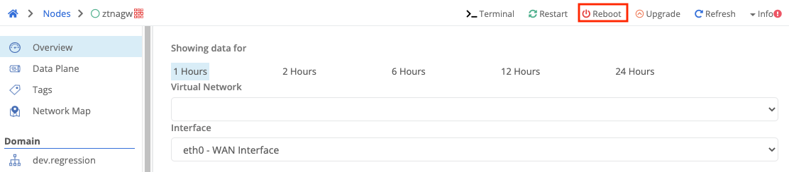
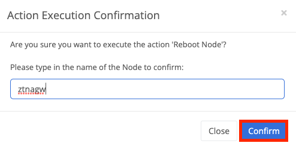

1. Click on the Node from the node page you wish to reboot
2. Select `Reboot` from the top right corner of the page

3. Type in the name of the node in the text box, and click the confirmation button

4. The node will reboot within 60 seconds
5. Node agent will start automatically on reboot
6. Expect the node to alert for disconnect/connect
7. Does not require a cloud gateway