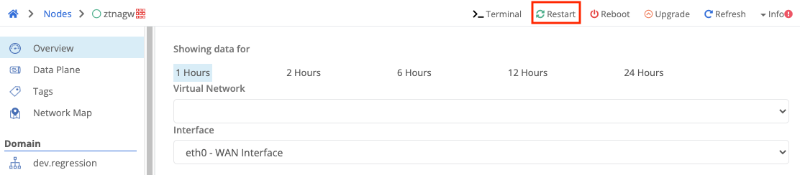
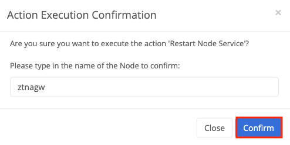

{}
Restarting the Trustgrid service is faster than a full node reboot and resolves many non-recurring problems.
{}

1. Go to the `Node` detail page for the node affected.

2. Select `Restart` located in the top right corner of the page

3. After clicking, type in the name of the node and click `Confirm` to execute the action

4. the node agent will restart (Node host will not restart)

5. Expect the node to alert for disconnection and connection.
