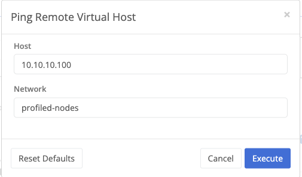
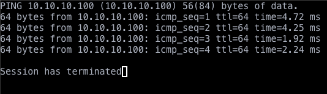

## Prerequisites

* Both the source and destination nodes should have a virtual management IP configured
	* There should be a unique IP under Node > Configuration > VPN  > Virtual Management IP
	* In the virtual network route configuration in your domain, a route should exist with the following settings:
		* Destination: node name (even if part of a cluster)
		* Destination CIDR: virtual management IP with a /32 suffix
		* Metric: 1
	* Use the [View Virtual Route Table]() tool to verify both the source and destination nodes have valid, available routes to each other's virtual management IP
* Need to know the virtual IP address of the inside NAT if targeting a local IP on the destination network
* Need to know the virtual management IP address of the destination node if only verifying VPN network connectivity


The [Ping Remote Node]() tool allows you to verify data plane communication by node name


## Usage

1. Login to the Trustgrid portal and navigate to the Node from which you want to test connectivity.
1. Select `VPN` under the `Network` section.
1. Click the `Tools` button and select the `Ping Remote Virtual Host` option from the `Select a service` dropdown.

	

1. Modify the host parameter to the target virtual IP address and click `Execute`.

1. A window will pop up with the content like below.

	

## Responses

There are several configuration elements that need to be configured and working for a VPN deployment to be successful.  When something is not configured correctly, the trustgrid node responds to an ICMP ping with a variety of different "Destination Unreachable" error messages that can indicate what exactly appears to be wrong.  Here are the error responses the node may give when attempting to ping a remote machine through the VPN when something is amiss.

### Destination Net Unknown

This error means that the node cannot find an interface network binding with an inside and outside nat that match the requests source and destination IP.  You should re-examine the inside and outside nats for the node interface that is receiving the packet, and make sure that an inside nat is defined that matches the source machines local IP and an outside nat that matches the virtual destination IP (or that no outside nat is present, which defaults to 1x1).

### Destination Net Unreachable

This error means that the node cannot find a route defined at the domain/network level for the destination IP in this request.  You should examine the domain route definitions and make sure that one is included for the virtual destination IP address you are trying to ping.  Use the [View Virtual Route Table]() tool using the target IP as a filter to confirm the route exists and is available.

### Destination Host Unreachable

This error indicates that there is a route defined for the ping dest IP, but that the destination node associated with the route is not currently connected to this node.  You should look at the routes in the source node's detail page in the portal and make sure that there is one included for the destination node that should be receiving the request.

### Packet Filtered

This error results when the ping request could not be performed do to the lack of a domain network ACL allowing the request.  While this itself only indicates that ICMP traffic is not allowed between these two hosts in this direction, it can be used as a valuable indicator of a bigger policy issue.  Check your ACL list in the portal to ensure that icmp are allowed between these to hosts.

### Destination Host Unknown

This error happens when the ping packet made it to the destination node, but no set of inside/outside nats could be found that include the source and destination IPs of this request.  Check the destination node VPN settings to ensure an inside NAT is present for the virtual destination IP of the request, and either an outside NAT exists and includes the virtual source IP, or no outside NAT is present, which defaults to 1x1.

### No Ping Response Error

When a ping sits there and no response is received, usually the best way to troubleshoot further is to [sniff interface traffic]() with a filter of `icmp and host <target-ip>` on the source and dest nodes.

When troubleshooting, keep in mind that the lack of an error likely means one of the following:

1. The local node VPN interface that should be receiving the packet hasn't been configured correctly.
1. The local firewall, router or target machine isn't correctly routing packets to the source node.
1. There is an ARP issue on either the source or destination node where the node isn't responding correctly (`tcpdump -i <data_nic> arp`)
1. There is no responding machine on the remote side!

