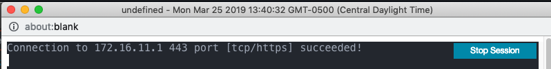

{}
The TCP Port Test tool initiates a TCP session with a target IP address and port to confirm fully layer 4 connectivity. This would be similar to using netcat or telnet to test connectivity to a TCP port.
{}

## Usage

1. Login to the Trustgrid portal and navigate to the Node from which you want to test connectivity.
1. Select `Interfaces` under the `Network` section.
1. Click the `Interface TCP Port Test` button

   

1. Update the host with the target IP address and the port with the target TCP port. Click `Execute` to test connectivity.

   

1. A new window will open with the results. If a new window does not open, check your browser's pop-up blocker settings.

   A successful test will look like this:

   

   A failed connection will look like this:

   
